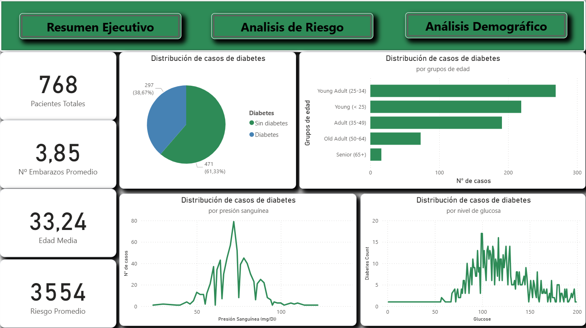
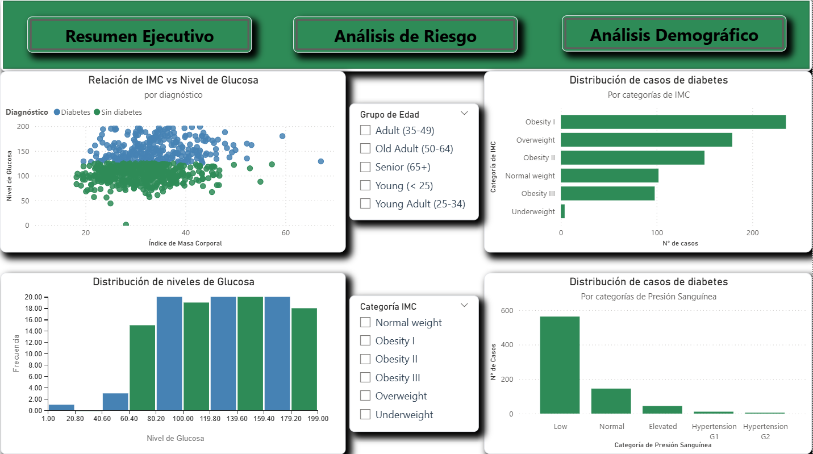
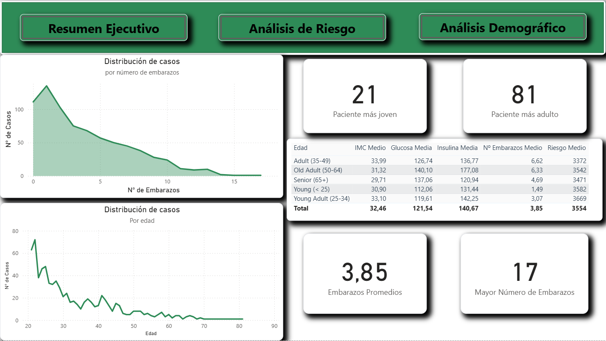

# 🩺 Diabetes Analytics Dashboard

Dashboard interactivo desarrollado con Power BI para el análisis exploratorio del dataset **Pima Indians Diabetes**. El objetivo es identificar los principales factores de riesgo asociados a la diabetes tipo 2 en una población específica de mujeres adultas, apoyando la comprensión clínica y epidemiológica de la enfermedad.

---

## 📋 Tabla de contenidos

- [Contexto clínico](#-contexto-clínico)
- [Dataset](#-dataset)
- [Preguntas analíticas](#-preguntas-analíticas)
- [Estructura del dashboard](#-estructura-del-dashboard)
- [Principales hallazgos](#-principales-hallazgos)
- [Estructura del repositorio](#-estructura-del-repositorio)
- [Tecnologías utilizadas](#-tecnologías-utilizadas)

---

## 🏥 Contexto clínico

La diabetes de tipo 2 es una de las enfermedades crónicas más prevalentes a nivel mundial. con especial incidencia en poblaciones con predisposición genética y determinadas condiciones metabólicas. El dataset *Pima Indians Diabetes* ha sido recopilado por el Instituto Nacional de Diabetes y Enfermedades Digestivas y Renales de Estados Unidos. Registra variables clínicas de 768 mujeres de ascendencia PIMA con al menos 21 años de edad.

Este proyecto aborda el análisis desde una perspectiva descriptiva y exploratoria, buscando responder preguntas clínicamente relevantes sobre los factores que más se asocian al diagnóstico positivo.

---

## 📊 Dataset

**Fuente:** [Kaggle - Diabetes PIME](https://www.kaggle.com/datasets/aryanpatel0204/diabetes-dashboard-power-bi)

| Variable                   | Descripción                                                                           |
| -------------------------- | ------------------------------------------------------------------------------------- |
| `Age`                      | Edad en años                                                                          |
| `Pregnancies`              | Número de embarazos                                                                   |
| `Glucose`                  | Concentración de glucosa en plasma (mg/Dl) a las dos horas en test oral de tolerancia |
| `BloodPressure (mg/Dl)`    | Presión arterial diastólica (mm/Hg)                                                   |
| `SkinThickness`            | Grosor del pliegue cutáneo del tríceps (mm)                                           |
| `Insulin`                  | Nivel de insulina sérica a las 2 horas(mu U/ml)                                       |
| `BMI`                      | Índice de masa corporal                                                               |
| `DiabetesPedigreeFunction` | Puntuación de predisposición genética a la diabetes                                   |
| `Outcome`                  | Diagnóstico (1 = diabetes, 0 = sin diabetes)                                          |

---

## ❓ Preguntas analíticas

Antes de construir el dashboard, se plantearon las siguientes preguntas que guiaron el análisis:

1. ¿Cuál es la prevalencia de diabetes en esta población?

2. ¿En qué grupo de edad se concentra el mayor número de casos?

3. ¿Qué relación existe entre el IMC y los niveles de glucosa con el diagnóstico?

4. ¿Cómo influye el número de embarazos en la distribución de casos?

5. ¿Qué categorías de presión arterial e IMC presentan mayor recuento de diabetes?

6. ¿Existen diferencias clínicas relevantes entre grupos de edad?

---

## 📐 Estructura del dashboard

El dashboard se organiza en tres páginas interconectadas mediante la barra de navegación superior:

### Resumen Ejecutivo

Vista general de la población: métricas clave (total de pacientes, edad media, embarazos medios, riesgo promedio), distribución de diagnósticos, distribución por grupos de edad, y distribuciones de presiones arterial y glucosa.

### Análisis de Riesgo

Análisis cruzado de los principales factores de riesgo: dispersión IMC/Glucosa segmentada por diagnósticos, distribución de niveles de glucosa por categorías de IMC, recuento de casos por categorías de IMC y por categorías de presión arterial. Incluye filtros interactivos por grupo de edad y categoría de IMC.

## Análisis Demográfico

Perspectiva demográfica: distribución de casos por número de embarazos, tendencia de diabetes por edad, y tabla resumen con medias de BMI, glucosa, insulina, embarazos y riesgo para cada grupo de edad.

---

## 🔍 Principales hallazgos

### Prevalencia y distribución general

- El 38,67% de las pacientes tienen diagnóstico positivo de diabetes, una tasa notablemente alta que refleja la predisposición característica de esta población.
- La distribución por edad muestra que los *Adultos Jóvenes (25-34 años)* concentran el mayor número de casos absolutos, seguidos del grupo menor de 25 años, lo que sugiere una alta incidencia en edades tempranas a esta población.

### Glucosa como indicador principal

- El gráfico de dispersión IMC/Glucosa evidencia una clara separación entre pacientes diabéticos y no diabéticos a partir de un nivel de glucosa superior a 125 mg/Dl. Los pacientes con diabetes tienden a agruparse en la zona de glucosa alta independientemente del IMC.

### IMC y obesidad

- La categoría *Obesidad 1* presenta el recuento más alto de casos de diabetes, seguida de *Sobrepeso* y *Obesidad 2*, confirmando la correlación establecida entre exceso de peso y riesgo diabético.
- Sin embargo, existe un número no despreciable de casos en la categoría *Peso Normal*, lo que indica que el IMC por si solo no es determinante.

### Embarazos y edad

- La distribución de diabetes por embarazos muestra un pico marcado en 1 embarazo, con un descenso progresivo. Los embarazos múltiples presentan recuentos muy bajos, aunque la proporción relativa de diagnósticos podría ser mayor.
- La tendencia de diabetes por edad confirma un pico en los *20-25 años* con caída sostenida, coherente con la estructura demográfica del dataset.

### Presión arterial

La mayoría de casos se agrupan en la categoría *Low* de presión arterial, lo cual puede responder en parte a valores cero en el dataset (datos ausentes codificados como 0), un conocido problema de calidad en esta fuente.

---

## 📁 Estructura del repositorio

DiabetesAnalytics/

├── data/

│   └── diabetes.csv           # Dataset original (Pima Indians Diabetes)

├── image/

│   ├── dashboard.gif          # Demostración animada del dashboard

│   ├── d1.png                 # Captura — Executive Summary

│   ├── d2.png                 # Captura — Risk Factor Analysis

│   └── d3.png                 # Captura — Demographic Analysis

├── notebook/

│   └── changes.ipynb     # Limpieza de datos en Python

├── theme/

│   └── diabetes_theme.json    # Tema personalizado de Power BI

├── diabetes.pbix              # Archivo Power BI

├── LICENSE

└── README.md

---

## 🛠 Tecnologías utilizadas

- **Power BI Desktop** — construcción del dashboard y modelado de datos
- **DAX** — medidas calculadas (grupos de edad, categorías de IMC, categorías de presión arterial, puntuación de riesgo)
- **Python / Jupyter Notebook** — limpieza de datos previa al desarrollo del dashboard
- **JSON** — tema personalizado de Power BI

---

## 📄 Licencia

Este proyecto está bajo la licencia [GPL-3.0](LICENSE).

----

Dataset de uso público procedente de Kaggle. Proyecto con fines analíticos y de aprendizaje.
